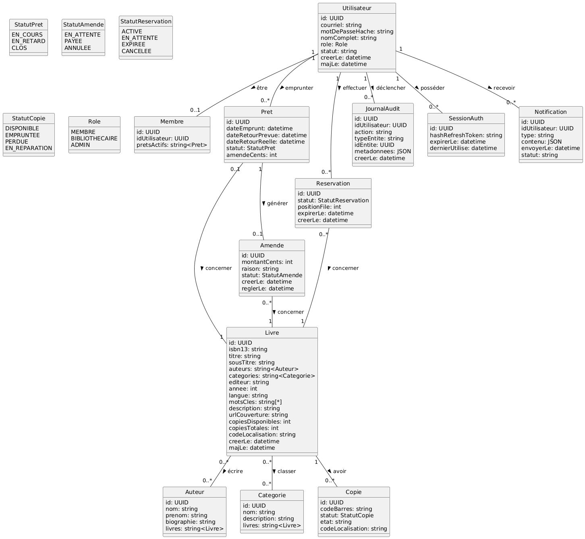
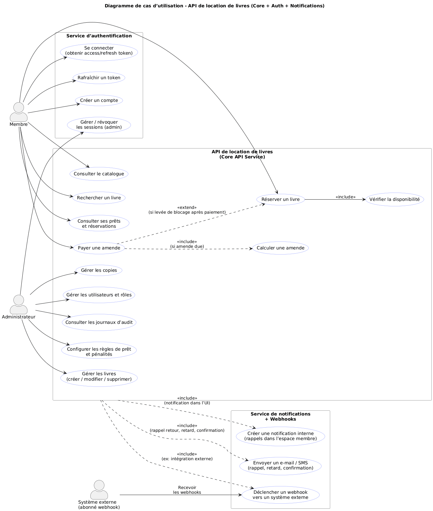
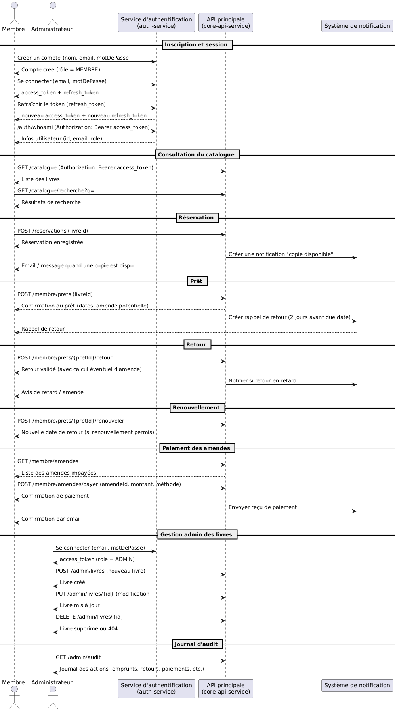
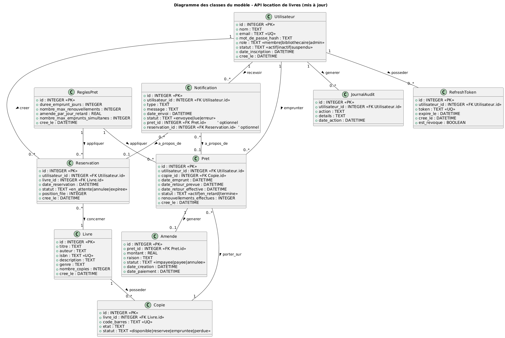
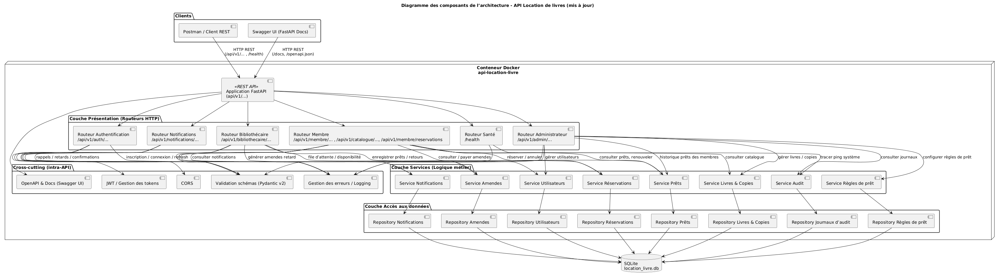
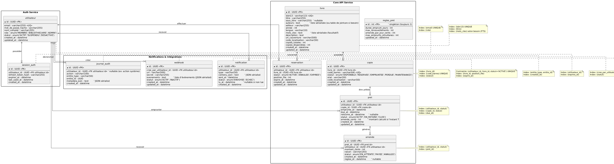

# location_livre

**Description du projet et de la problématique**

- Cette API de location de livres permet à une application de gérer l’ensemble du cycle de prêt de livres : 
elle offre des fonctionnalités pour inscrire des utilisateurs, cataloguer les livres disponibles, effectuer 
des réservations, suivre le prêt et le retour, avec gestion d’un historique. Elle assure également la 
sécurité des opérations via une authentification, et permet aux administrateurs de créer, modifier ou 
supprimer des livres ou des utilisateurs. En résumé, c’est une interface backend complète pour automatiser
et centraliser tout ce qui concerne la location de livres.

- Aujourd’hui, la gestion des prêts dans de nombreuses bibliothèques reste manuelle ou mal centralisée, ce qui entraîne des erreurs, un manque de visibilité sur les disponibilités et une perte de temps pour les usagers comme pour les gestionnaires.

- Cette API vise donc à automatiser, centraliser et sécuriser la gestion des locations de livres, afin d’améliorer l’efficacité du suivi, de réduire les erreurs humaines et d’offrir une meilleure expérience aux utilisateurs.

- L’API location_livre est une interface backend qui permet à une application de gérer l’ensemble du cycle de prêt de livres : inscription des utilisateurs, catalogage des ouvrages, réservations, suivi des prêts et des retours, ainsi que la gestion d’un historique.
Elle garantit la sécurité des opérations grâce à une authentification et permet aux administrateurs de créer, modifier ou supprimer des livres et des utilisateurs.

**Description de la problématique**

- La gestion des prêts de livres dans de nombreuses bibliothèques se fait encore de manière manuelle ou à l’aide d’outils dispersés, ce qui rend le suivi des emprunts et des retours fastidieux et peu fiable.
Ce mode de fonctionnement entraîne plusieurs difficultés : manque de visibilité sur la disponibilité des ouvrages, erreurs humaines dans l’enregistrement des prêts, absence de traçabilité des opérations et perte de temps pour le personnel et les usagers.

La problématique à laquelle répond ce projet est la suivante :

- Comment concevoir un système automatisé, centralisé et sécurisé permettant de gérer efficacement la location de livres, tout en simplifiant le travail des administrateurs et en offrant aux utilisateurs une meilleure expérience d’emprunt ?

Cette API vise donc à automatiser, centraliser et sécuriser la gestion des locations de livres, afin d’améliorer l’efficacité du suivi, de réduire les erreurs humaines et d’offrir une meilleure expérience aux utilisateurs.

---

**Identification des acteurs et personas:**

- Dans le cadre de cette API, plusieurs types interagissent avec le système. Ces acteurs ont des besoins et des droits différents.

- **Membre** : Utilisateur standard de la bibliothèque.  
Objectifs : Recherche de livres, réservation, emprunt, retour, paiement d’amendes.  
Actions : Créer un compte, se connecter, réserver, consulter l’historique.

- **Administrateur** : Responsable du bon fonctionnement global du système.  
Objectifs : Gérer utilisateurs, livres, règles métier, logs d’audit.  
Actions : Créer/supprimer des utilisateurs, ajouter des livres, modifier les règles.

- **Acteurs principaux** : Membre, Admin

---

# 1. Récits utilisateurs et cas d'utlisations

Alice : **Membre**

---

## 1. Authentification

### Récit utilisateur
En tant que visiteur, j’ai besoin de m’authentifier afin de devenir membre et emprunter des livres.

### Objectifs UX
- Étant donné un visiteur non authentifié, lorsqu’il accède au point d’entrée d’inscription ou de connexion, alors il peut devenir membre et recevoir un message de confirmation.

### Critères d’acceptation API
- Étant donné une requête d’authentification avec un nom, un courriel et un mot de passe valides, alors l’API crée un nouvel utilisateur, assigne le rôle membre par défaut et renvoie un message de succès.

### Endpoints et codes de retour
- **POST /auth/register**
  - 200 Created → compte créé  
  - 400 Bad Request → données invalides

---

## 2. Consultation du catalogue

### Récit utilisateur
En tant que membre, j’ai besoin de consulter le catalogue afin de rechercher et découvrir des livres.

### Objectifs UX
- Étant donné un membre authentifié, lorsqu’il accède à la page du catalogue, alors il peut rechercher un livre par titre, auteur, mot-clé ou ISBN.

### Critères d’acceptation API
- Étant donné une requête vers le catalogue, lorsqu’elle est valide, alors l’API renvoie la liste des livres ainsi que leur disponibilité.

### Endpoints
- **GET /catalogue** → 200 OK / 401 Unauthorized

---

## 3. Réservation d’un livre

### Récit utilisateur
En tant que membre, j’ai besoin de réserver un livre emprunté afin d’être notifié lorsqu’il devient disponible.

### Objectifs UX
- Étant donné un membre authentifié, lorsqu’il clique sur « Réserver » d’un livre indisponible, alors il voit une confirmation de réservation.

### Critères d’acceptation API
- Étant donné une demande de réservation valide, alors l’API enregistre la réservation et attribue automatiquement un rang dans la file d’attente.

### Endpoints
- **POST /reservations** → 201 Created / 409 Conflict / 401 Unauthorized

---

## 4. Consultation du profil

### Récit utilisateur
En tant que membre, j’ai besoin de consulter mes prêts actifs et mes réservations en cours.

### Objectifs UX
- Étant donné un membre authentifié, lorsqu’il accède à la page Profil, alors il peut visualiser ses prêts et réservations.

### Critères d’acceptation API
- Étant donné une requête valide, alors l’API retourne la liste des prêts actifs et des réservations associées au membre.

### Endpoints
- **GET /membre/prets** → 200 OK / 401 Unauthorized

---

## 5. Paiement des amendes

### Récit utilisateur
En tant que membre, j’ai besoin de payer mes amendes en ligne.

### Objectifs UX
- Étant donné un membre authentifié, lorsqu’il accède à la section « Mes amendes », alors il peut effectuer un paiement en ligne.

### Critères d’acceptation API
- Étant donné un paiement valide, alors l’API enregistre le paiement et met à jour le solde du membre.

### Endpoints
- **POST /membre/amendes/{amendeId}/payer**  
  → 200 OK / 404 Not Found / 401 Unauthorized

---

## 6. Renouvellement d’un prêt

### Récit utilisateur
En tant que membre, j’ai besoin de renouveler un prêt si aucune réservation n’existe.

### Objectifs UX
- Étant donné un membre authentifié, lorsqu’il clique sur « Renouveler », alors il voit une nouvelle date de retour si l’opération est permise.

### Critères d’acceptation API
- Étant donné une demande de renouvellement valide sans réservation en attente, alors l’API prolonge la durée du prêt.

### Endpoints
- **POST /membre/prets/{pretId}/renouveler**  
  → 200 OK / 409 Conflict / 404 Not Found / 401 Unauthorized

---

# 

Marie : **Administrateur**

---

## 1. Gestion du catalogue

### Récit utilisateur
En tant qu’administrateur, j’ai besoin d’ajouter, modifier ou supprimer un livre afin de maintenir le catalogue à jour.

### Objectifs UX
- Étant donné un administrateur authentifié, lorsqu’il accède à la section « Gestion du catalogue », alors il peut gérer les livres.

### Critères d’acceptation API
- Étant donné une requête valide, alors l’API met à jour le catalogue et renvoie l’état du traitement.

### Endpoints
- **POST /admin/livres** → 201 Created / 400 Bad Request / 403 Forbidden  
- **PUT /admin/livres/{livreId}** → 200 OK / 400 Bad Request / 404 Not Found / 403 Forbidden  
- **DELETE /admin/livres/{livreId}** → 200 OK / 404 Not Found / 400 Bad Request / 403 Forbidden

---

# 2. Documentation des erreurs

## Codes de retour génériques

| Code | Signification | Description |
|------|--------------|-------------|
| **200 OK** | Succès | Opération exécutée correctement. |
| **201 Created** | Ressource créée | Une nouvelle ressource a été ajoutée. |
| **400 Bad Request** | Requête invalide | Données incorrectes, format invalide. |
| **401 Unauthorized** | Non authentifié | Jeton JWT manquant ou invalide. |
| **403 Forbidden** | Accès refusé | Rôle insuffisant ou limite atteinte. |
| **404 Not Found** | Introuvable | Ressource inexistante. |
| **409 Conflict** | Conflit | Par ex. réservation déjà existante. |
| **422 Unprocessable Entity** | Données non traitables | Par ex. livre endommagé. |
| **423 Locked** | Ressource verrouillée | Réservation prioritaire ou retour impossible. |
| **500 Internal Server Error** | Erreur serveur | Problème interne. |
| **503 Service Unavailable** | Service indisponible | Maintenance ou surcharge. |

---

# 3. Autorisations et rôles

## Rôles disponibles

### Membre  
Peut : consulter catalogue, réserver, consulter prêts, payer amendes, renouveler.

### Bibliothécaire  
Peut : gérer prêts/retours, renouvellements, file de réservation.

### Administrateur  
Peut : gérer catalogue, utilisateurs, audit.

---

## Règles d’accès
- Endpoints **/membre/** → membres authentifiés  
- Endpoints **/bibliothecaire/** → bibliothécaires + administrateurs  
- Endpoints **/admin/** → administrateurs uniquement  

### JWT
- Sans jeton → 401  
- Rôle insuffisant → 403  

---

# 4. Modèles de données et Validations

## 4.1 Modèle **User**

### Description  
Représente un utilisateur du système : membre, bibliothécaire ou administrateur.

### Champs  
- **id**
- **email**
- **full_name**
- **password_hash**
- **role**

### Règles de validation  
- Email obligatoire + unique  
- Mot de passe requis  
- Rôle ∈ {membre, bibliothecaire, admin}

---

## 4.2 Modèle **Book**

### Description  
Un livre du catalogue.

### Champs  
- id  
- title  
- author  
- year  
- total_copies  
- available_copies  

### Règles  
- title, author, year obligatoires  
- total_copies ≥ 1  
- available_copies ∈ [0, total_copies]

---

## 4.3 Modèle **Pret**

### Description  
Un prêt enregistré.

### Champs  
- id  
- user_id  
- book_id  
- date_pret  
- date_retour  
- renouvellements  

### Règles  
- user_id & book_id obligatoires  
- date_pret obligatoire  
- renouvellements ≥ 0  
- renouvellement impossible si réservation active  

---

## 4.4 Modèle **Reservation**

### Description  
Une réservation sur un livre indisponible.

### Champs  
- id  
- user_id  
- book_id  
- created_at  

### Règles  
- utilisateur + livre existants  
- une seule réservation par livre par utilisateur  
- impossible de réserver si déjà emprunté par le même membre  

---

# Diagrammes

## Diagramme de classes

## Diagramme de Cas d'utilisation

## Diagramme de séquences

## Diagramme de classes modèles

## Diagramme de composants Architectures

## Diagramme de modèle relationnels

---

## Démonstration

### Regarder la démo (cmd + click)

<a href="https://rajbhanif.github.io/api-location-livre/api-location-livre.mp4" target="_blank">▶ Cliquez ici pour ouvrir la vidéo de démo</a>

*La vidéo s'ouvrira directement dans votre navigateur*

# Liens importants

## Local 
http://localhost:8000/docs

## Documentation FastAPI
http://localhost:8000/docs

## Déploiement
http://idefix.dti.crosemont.quebec:10169/docs#/

## Postman
https://clearform-conseil.postman.co/workspace/My-Workspace~f6795483-5eae-4be6-8755-286a6335b6e9/collection/46498727-f1643f0f-87f0-4b23-8974-e7ea9f951dbe

## Miro
https://miro.com/app/board/uXjVJFbMhHQ=/?share_link_id=455576582743
